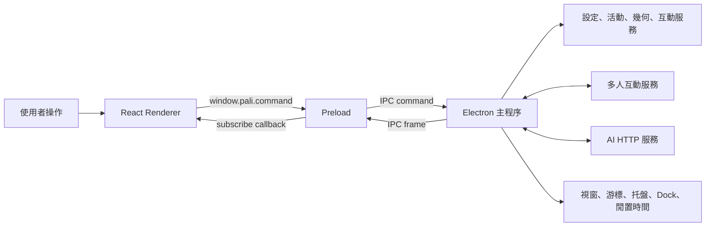
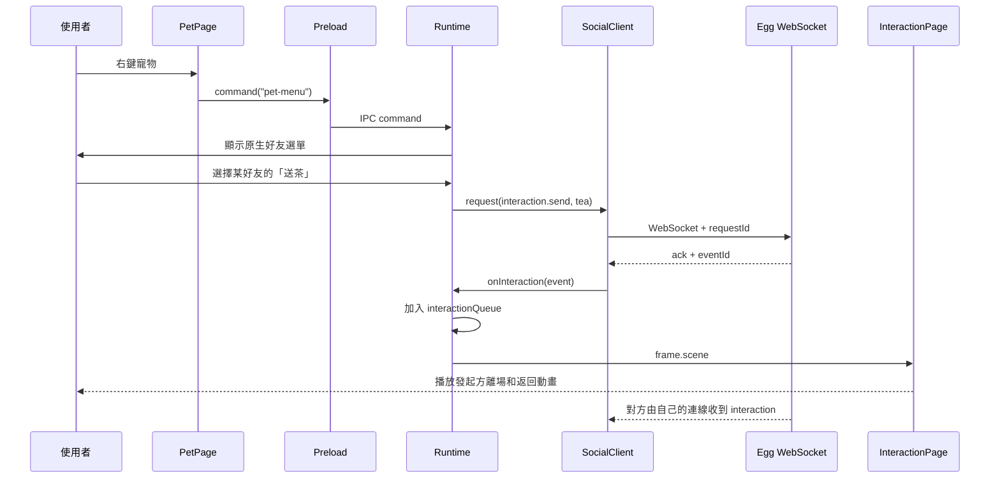

# Pali 前端程式執行流程

下面按「應用啟動 → Electron 主程序 → IPC → React 渲染 → 寵物移動 → 點擊拖曳 → 好友互動 → AI → 設定保存 → 打包」把目前前端專案完整串起來。

> 本文件描述的是目前程式的實際執行方式。專案中的「前端」包含 Electron 主程序、Preload 安全橋接和 React Renderer，不只是 React 畫面。

## 一、先理解整體分層

Pali 同時運行三個不同職責的環境：

| 層級            | 主要目錄        | 負責內容                                                                                         |
| --------------- | --------------- | ------------------------------------------------------------------------------------------------ |
| Electron 主程序 | `src/main/`     | 建立原生視窗、讀取游標和系統閒置時間、移動桌寵、顯示托盤、保存設定、連接 WebSocket、呼叫 AI 服務 |
| Preload         | `src/preload/`  | 在安全隔離下，只向 React 暴露經過限制的 IPC 方法                                                 |
| React Renderer  | `src/renderer/` | 繪製控制台、桌寵、氣泡、好友面板和互動動畫，接收狀態並把操作送回主程序                           |
| 共用契約        | `src/shared/`   | 保存角色資料，以及主程序與 React 之間共用的 TypeScript 型別                                      |

整體資料流如下：



React 不直接讀檔案、建立原生視窗或連接系統 API。這些能力集中在 Electron 主程序中，再通過 IPC 提供給畫面使用。

## 二、應用啟動

### 2.1 開發模式

執行：

```sh
npm run dev
```

`package.json` 使用 `concurrently` 同時啟動兩個程序：

1. `vite --host 127.0.0.1` 在 `5173` 連接埠啟動 React 開發伺服器。
2. `wait-on` 等待 Vite 可訪問後，執行 `electron . --dev`。
3. Electron 根據 `package.json` 的 `main` 欄位載入 `src/main/index.cjs`。

開發模式下，`src/main/windows/factory.cjs` 會讓所有 Electron 視窗載入：

```text
http://127.0.0.1:5173/?view=視窗類型
```

因此所有視窗共用同一套 React 程式，只用 `view` 查詢參數決定顯示哪個頁面。

### 2.2 雙開測試

第二個測試實例執行：

```sh
npm run dev:second
```

這個指令不再啟動一套 Vite，而是重用第一個實例的 `5173` 開發服務。`src/main/index.cjs` 讀取 `--instance=second`，把第二個實例的 `userData` 改為：

```text
系統 appData/pali-test-second
```

這樣兩個實例擁有各自的設定、WebSocket 身分和單實例鎖，可以在同一台電腦測試好友互動。

### 2.3 正式模式

執行 `npm start` 時沒有 `--dev`，`factory.cjs` 會改為載入：

```text
dist/index.html?view=視窗類型
```

所以正式運行前必須先有 `npm run build` 生成的 `dist/`。

## 三、Electron 主程序

### 3.1 啟動入口

`src/main/index.cjs` 是最早執行的程式，主要做三件事：

1. 解析可選的 `--instance`，為雙開測試隔離 `userData`。
2. 限制實例名稱只能包含字母、數字、底線和連字號，避免任意路徑寫入。
3. 引入 `src/main/runtime.cjs` 並呼叫 `startApplication()`。

### 3.2 Runtime 中央協調器

`src/main/runtime.cjs` 是整個桌面應用的中心。它不負責繪製角色，而是保存運行狀態並協調所有服務：

- `settings`：目前角色、尺寸、心情、散步、睡眠、提醒和上次位置。
- `pet`：透明桌寵視窗。
- `bubble`：台詞、好友聊天和 AI 輸入視窗。
- `panel`：設定控制台，啟動時不建立，使用者需要時才開啟。
- `interactionWindow`：覆蓋工作區的透明好友互動動畫視窗。
- `tray`：頂部選單列或系統托盤圖示。
- `drag`、`target`、`fall`、`dizzyUntil`：拖曳、散步和暈倒狀態。
- `activity`：工作與閒置時間統計。
- `social`：唯一的好友 WebSocket 客戶端。

### 3.3 Electron Ready 後建立視窗

`app.whenReady()` 後，Runtime 依序完成：

1. 從 Electron `userData` 載入一般設定。
2. 在 macOS 呼叫 `app.setActivationPolicy("accessory")` 和 `app.dock.hide()`，保持 Dock 不顯示圖示。
3. 建立 `pet`、`bubble`、`interactionWindow` 三個常駐視窗。
4. 建立托盤圖示和「打開控制台、顯示／隱藏、帶回主螢幕、退出」選單。
5. 註冊 IPC 命令。
6. 載入好友互動設定並建立 `SocialClient`。
7. 啟動定時更新，持續計算游標、散步、活動時間和動畫狀態。

控制台 `panel` 不會隨應用一起打開。點擊托盤、寵物右鍵選單或送出 `panel` 命令時，`openPanel()` 才建立或重新顯示它。

### 3.4 視窗工廠與安全配置

所有視窗由 `src/main/windows/factory.cjs` 建立，統一使用：

```js
contextIsolation: true;
nodeIntegration: false;
sandbox: true;
```

同時禁止 Renderer 自行打開新視窗和任意跳轉。這使 React 頁面不能直接取得 Node.js、檔案系統或完整 Electron API。

## 四、IPC 通訊流程

### 4.1 React 發送命令

`src/preload/index.cjs` 通過 `contextBridge` 暴露兩個方法：

```ts
window.pali.command(action, value);
window.pali.subscribe(callback);
```

例如切換角色時，React 呼叫：

```ts
window.pali.command("character", petId);
```

實際鏈路是：

```text
React 元件
  → renderer/lib/bridge.ts 或 window.pali.command()
  → preload 的 ipcRenderer.send("command", action, value)
  → main/ipc/register.cjs
  → runtime.cjs 的命令處理函式
```

### 4.2 主程序驗證命令

`src/main/ipc/register.cjs` 不會直接相信 Renderer 傳入的資料。它會：

1. 確認事件來自本應用已知視窗。
2. 判斷命令是否只允許桌寵視窗發出，例如拖曳和寵物右鍵選單。
3. 檢查布林值、尺寸、心情、角色、互動資料和文字長度等參數。
4. 驗證通過後才把命令交給 Runtime。

`src/shared/protocol.ts` 提供編譯期型別，`register.cjs` 則提供執行期驗證，兩者用途不同，不能互相替代。

### 4.3 主程序回傳狀態

`factory.cjs` 的 `send(win, data)` 使用：

```js
win.webContents.send("frame", data);
```

Preload 訂閱 `frame` 通道，再把資料傳給 React。回傳資料分為：

- 完整 `Frame`：角色、尺寸、游標座標、活動時間、移動狀態、好友狀態和互動場景。
- `{ reaction: true }`：觸發短暫開心反應。
- `{ speech: string }`：更新普通台詞。
- `{ chat: ... }`：打開或關閉指定好友聊天。
- `{ ai: boolean }`：打開或關閉 AI 輸入。

## 五、React 渲染流程

### 5.1 React 入口

`src/renderer/main.tsx` 載入樣式並把 `<App />` 掛載到 `index.html` 的根節點。

`src/renderer/app/App.tsx` 讀取網址中的 `view`：

| `view`           | React 頁面        | 用途                        |
| ---------------- | ----------------- | --------------------------- |
| `panel` 或未匹配 | `SettingsPage`    | 控制台與設定管理            |
| `pet`            | `PetPage`         | 透明桌寵本體                |
| `bubble`         | `SpeechPage`      | 普通台詞、好友聊天、AI 輸入 |
| `interaction`    | `InteractionPage` | 全工作區雙角色互動動畫      |

### 5.2 共用狀態 Hook

每個 Renderer 視窗都會執行 `useCompanion()`：

1. 先使用 `renderer/lib/defaults.ts` 提供的初始 Frame，避免首屏沒有資料。
2. 呼叫 `window.pali.subscribe()` 訂閱主程序事件。
3. 完整 Frame 更新 `frame`。
4. 台詞、聊天、AI 和 reaction 事件分別更新自己的 React state。
5. 元件卸載時取消 IPC 監聽並清除 reaction 計時器。

`SettingsPage` 再組合 `Sidebar`、`CharacterHero`、`CharacterPicker`、`CompanionSettings` 和 `SocialPanel`。角色 SVG 由 `PetAvatar` 根據 `petId` 分派給 `Penguin`、一般動物繪製或 `CartoonPet`。

## 六、寵物移動規則

寵物平時不會跟隨滑鼠位置。游標和寵物有三種不同關係：

1. **眼睛追蹤**：Runtime 把游標換算成角色內部的相對座標，角色元件據此調整眼睛方向。
2. **拖曳跟隨**：只有按住並拖曳寵物時，原生視窗才跟著游標移動。
3. **自動散步**：開啟散步後，Runtime 隨機產生附近目標點，與游標位置無關。

### 6.1 自動散步

`runtime.cjs` 的 `tick()` 在滿足以下條件時才允許散步：

- `settings.roaming` 已開啟。
- 沒有睡眠。
- 寵物可見。
- 右鍵選單未打開。
- 沒有好友互動場景。
- 沒有暈倒或恢復。

等待時間到達後，程式以目前位置為中心，隨機選擇約 `±200px` 水平和 `±80px` 垂直範圍內的新目標，並用每秒約 `65px` 的速度移動。距離目標小於 `3px` 後停止，再等待約 `4–11 秒` 選擇下一個目標。

`services/geometry.cjs` 的 `clampPosition()` 會把目標和實際位置限制在目前顯示器的可用工作區內，避免角色跑出螢幕。

### 6.2 眼睛方向

主程序讀取 `screen.getCursorScreenPoint()`，再把螢幕座標換算為角色 `280 × 280` SVG 座標：

```text
relativeX = (cursorX - petWindowX) / petSize × 280
relativeY = (cursorY - petWindowY) / petSize × 280
```

React 將這組 `mouse` 資料傳給角色元件。`Penguin.tsx`、`PetAvatar.tsx` 和 `CartoonPet.tsx` 各自根據角色眼睛中心計算偏移量，因此看起來像眼睛一直望向游標。

## 七、點擊、部位反應與拖曳

### 7.1 透明區域穿透

桌寵視窗本身是方形透明視窗。Runtime 使用 `hitPet()` 和 `pets.json` 中的角色命中區域判斷游標是否真的位於角色身體上：

- 游標在角色外：`setIgnoreMouseEvents(true, { forward: true })`，點擊穿透到桌面。
- 游標在角色上：恢復滑鼠事件，允許點擊、拖曳和右鍵。

### 7.2 一般點擊和部位點擊

`PetPage.tsx` 區分拖曳與點擊。如果指標沒有形成有效拖曳，會依 `pets.json` 的命中區域判斷手、腳、耳朵／頭頂：

- 手：揮手動畫和對應台詞。
- 腳：抬腳／跳動動畫和對應台詞。
- 耳朵：抖耳或歪頭動畫和對應台詞。
- 普通身體點擊：送出 `pet` 命令，Runtime 使用 `dialogue()` 循環產生不同台詞。

Runtime 將部位反應保存為帶截止時間的 `partReaction`，React 通過 CSS class 播放整體連動動畫，避免手腳看起來與身體分離。

### 7.3 拖曳流程

拖曳呼叫鏈如下：

```text
PetPage pointerdown
  → command("drag-start")
  → Runtime 記錄游標相對視窗的偏移
  → tick() 持續取得全域游標位置
  → clampPosition()
  → pet.setPosition(x, y)
  → PetPage pointerup / pointercancel
  → command("drag-end")
  → 保存最後位置
```

由主程序取得全域游標並移動 BrowserWindow，可以讓拖曳在透明、無邊框視窗中持續正常運作。

### 7.4 快速左右晃動與暈倒

拖曳開始時，`services/shake.cjs` 建立一段新的軌跡。拖曳期間持續送入水平游標位置，只有在限定時間內出現足夠幅度和次數的左右反向動作才會觸發：

1. 結束普通拖曳。
2. 計算目前螢幕底部位置。
3. 在約 `600ms` 內讓寵物落地。
4. 將狀態依次設為 `falling`、`dizzy`、`recovering`。
5. 約 `3.8 秒` 後恢復，重新允許散步。

慢速移動、單向拖動和幅度很小的抖動不會觸發。

## 八、好友在線與互動

### 8.1 自動連線

互動設定由 `src/main/services/social/settings.cjs` 管理，預設網址是：

```text
ws://47.113.228.135:8060/pali/ws
```

啟用自動連線後，`SocialClient` 建立 WebSocket。連接成功時先發送 `hello`：

```json
{
  "type": "hello",
  "protocol": 1,
  "character": "目前角色",
  "accessKey": "可選密鑰"
}
```

後端回覆 `welcome` 後，客戶端保存自己的臨時身分和其他在線夥伴列表。`presence` 訊息會持續更新在線人員。這些身分由後端對 WebSocket 連線分配，因此不需要帳號和註冊；斷線重連後臨時編號可能改變。

### 8.2 發起互動

使用者可以從 `SocialPanel.tsx` 或寵物右鍵選單選擇好友。現有操作包括送茶、飛吻、抱抱、加油、一起打球和文字聊天。

以飛吻為例：

```text
React / 原生右鍵選單
  → social-action: { type: "interaction.send", to, action: "kiss" }
  → Runtime
  → SocialClient.request()
  → WebSocket 發送給後端
  → 後端回覆發起方 ack，並向接收方發 interaction
```

每次請求附帶 `requestId`。客戶端同一時間只允許一個待確認操作，8 秒沒有確認就提示逾時，避免使用者連續重送造成重複動畫。

### 8.3 雙方動畫如何播放

`SocialClient` 收到成功 `ack` 或對方的 `interaction` 後，呼叫 `playInteraction()`。`eventId` 會放入去重集合，避免同一事件重播，再由 Runtime 放入 `interactionQueue`。

Runtime 取出佇列事件時：

1. 根據桌寵所在顯示器取得工作區。
2. 將 `interactionWindow` 擴大為整個工作區。
3. 計算原桌寵位置、角色尺寸和動畫目標位置。
4. 暫時把原桌寵透明度設為 `0`。
5. 把完整 `scene` 傳給 `InteractionPage.tsx`。
6. 約 `6.5 秒` 後關閉場景並恢復原桌寵。

場景帶有 `perspective`：

- 發起方桌面使用 `sender`，自己的寵物走到左側消失，動畫結束後再從左側回到原位置。
- 接收方桌面使用 `receiver`，保留以自己的桌寵為中心的雙角色互動場景。

所有互動共用入場、動作、離場和佇列機制，只由 `action` 決定中間播放送茶、親親、抱抱、加油或打球動畫。

### 8.4 聊天

選擇聊天後，Runtime 將 `bubble` 視窗切換為可聚焦的 `360 × 142` 輸入框，並向 `SpeechPage` 發送好友資料。送出內容會轉成：

```ts
{ type: "chat.send", to: peerId, text }
```

已發送和已接收訊息保存在 `SocialClient.state.chat` 的記憶體中，最多保留最近 200 筆。它不是資料庫，退出應用後不會保留聊天記錄。

### 8.5 相容舊後端

如果連線時後端對新角色回覆 `HELLO_REQUIRED` 或 `INVALID_CHARACTER`，客戶端會用企鵝身分再執行一次 hello，本機角色外觀保持不變，讓舊後端仍能建立連線。

`protocol.ts` 和 `SocialClient` 仍保留舊版打球邀請／球局訊息型別，用於協議相容；目前控制台的「一起打球」走的是 `interaction.send` 的 `ball` 動作，點擊後直接播放動畫，不需要接受或結束球局。

## 九、AI 問答流程

AI 輸入同樣使用 `bubble` 視窗，但與好友 WebSocket 是兩條不同鏈路。

從寵物右鍵選單選擇 AI 後：

1. `openAi()` 關閉好友聊天狀態。
2. 把氣泡調整為可輸入的 `360 × 142` 視窗。
3. 向 Renderer 發送 `{ ai: true }`。
4. `SpeechPage.tsx` 顯示「問問 Pali」輸入表單。
5. 送出時發送 `ai-ask` IPC 命令。
6. Runtime 的 `askDeepSeek()` 使用 `fetch` POST 到 AI HTTP 端點。

目前端點在 `runtime.cjs` 中設定為：

```text
http://47.113.228.135:8060/api/deepseek
```

請求內容只有：

```json
{ "prompt": "使用者輸入內容" }
```

主程序先顯示「讓我想一下～」，最多等待 30 秒。成功時讀取 `result.reply` 或 `reply` 並顯示在普通台詞氣泡中；格式錯誤、HTTP 錯誤、逾時或無法連線時顯示統一失敗提示。

前端請求沒有傳入「你叫 Pali」的 system prompt、角色名稱或歷史對話。如果 AI 回答自己叫 Pali，這個設定來自後端 `/api/deepseek` 的提示詞或模型服務配置，不是 React 元件自動知道的。

## 十、設定保存

### 10.1 一般設定

`src/main/services/settings.cjs` 管理：

- `character`：角色。
- `size`：寵物尺寸。
- `mood`：心情。
- `roaming`：是否散步。
- `sleeping`：是否睡眠。
- `reminders`：是否顯示活動提醒。
- `x`、`y`：桌寵最後位置。

一般設定保存在：

```text
Electron userData/pali-settings.json
```

載入時只採用合法欄位，並處理舊尺寸遷移。設定改變或拖曳結束後，Runtime 呼叫 `saveSettings()` 寫入檔案。工作／閒置時間和聊天記錄只存在記憶體中，不會寫入此檔案。

### 10.2 好友互動設定

互動網址、自動連線開關和可選密鑰保存在：

```text
Electron userData/pali-social.json
```

密鑰在 Electron `safeStorage` 可用時加密後再以 Base64 保存。若系統加密能力不可用，程式不會把明文密鑰寫入磁碟。

### 10.3 React 設定更新鏈路

例如使用者把尺寸改為 `120`：

```text
CompanionSettings
  → useCompanion.update("size", 120)
  → window.pali.command("size", 120)
  → IPC 驗證尺寸白名單
  → Runtime 更新 settings.size
  → 調整原生寵物視窗大小和位置
  → saveSettings()
  → 下一個 Frame 回傳 React
```

React 只負責表單和預覽，最終真實狀態以主程序回傳的 Frame 為準。

## 十一、建置與打包

### 11.1 React 建置

執行：

```sh
npm run build
```

實際依次執行：

1. `tsc --noEmit`：依 `tsconfig.json` 對 React、共享型別和 Vite 設定做嚴格型別檢查，不生成 JavaScript。
2. `vite build`：依 `vite.config.ts` 打包 React Renderer，輸出到 `dist/`。

Vite 的 `base: "./"` 讓正式頁面可以從 Electron 本機檔案協議正確載入 CSS 和 JavaScript。

主程序和 Preload 目前保持 CommonJS `.cjs` 原始檔，electron-builder 直接把它們複製進應用，不經 Vite 打包。

### 11.2 macOS 安裝包

執行：

```sh
npm run dist:mac
```

它先執行前端建置，再由 `electron-builder` 生成 Apple Silicon `arm64` 和 Intel `x64` 的 DMG。主要配置包括：

- `appId`: `com.pali.desktop`
- `productName`: `Pali`
- 圖示：`assets/dock.png`
- `LSUIElement: true`：以選單列應用模式運行，不在 Dock 常駐顯示。
- `identity: "-"`：目前是 ad-hoc 簽署，未做 Developer ID 簽署與 Apple 公證。

### 11.3 Windows 安裝包

執行：

```sh
npm run dist:win
```

它生成 Windows x64 NSIS 安裝程式，允許使用者選擇安裝目錄，並建立桌面及開始選單捷徑。目前未配置正式程式碼簽章憑證。

### 11.4 被放入安裝包的內容

`electron-builder.json` 只收集運行需要的檔案：

```text
dist/**/*
src/main/**/*.cjs
src/preload/**/*.cjs
src/shared/**/*.json
assets/**/*
package.json
```

TypeScript 原始元件、測試、文件和開發配置不會放進正式安裝包。產物統一輸出到 `outputs/`，檔名格式為：

```text
Pali-版本-系統-架構.副檔名
```

## 十二、一條完整操作鏈示例

以「右鍵寵物，向在線好友送茶」為例，完整鏈路是：



這條鏈路反映了專案的核心原則：React 管理畫面，Preload 控制能力入口，Runtime 管理桌面狀態，Service 處理可獨立測試的規則，後端負責跨網路轉送。

## 十三、修改功能時從哪裡開始

| 修改目標               | 建議先看的檔案                                                                                         |
| ---------------------- | ------------------------------------------------------------------------------------------------------ |
| 應用啟動、單實例、雙開 | `src/main/index.cjs`、`src/main/runtime.cjs`                                                           |
| 新增 Electron 視窗     | `src/main/windows/factory.cjs`、`src/renderer/app/App.tsx`                                             |
| 新增 IPC 命令          | `src/shared/protocol.ts`、`src/main/ipc/register.cjs`、`src/main/runtime.cjs`、`src/preload/index.cjs` |
| 新增角色               | `src/shared/pets.json`、`src/renderer/features/characters/PetAvatar.tsx`                               |
| 修改移動或拖曳         | `src/main/runtime.cjs`、`src/main/services/geometry.cjs`、`src/renderer/features/pet/PetPage.tsx`      |
| 修改晃動暈倒           | `src/main/services/shake.cjs`、`src/main/runtime.cjs`、`src/renderer/styles/pet.css`                   |
| 修改好友協議           | `src/main/services/social/client.cjs`、`src/shared/protocol.ts`                                        |
| 修改好友面板和右鍵選單 | `src/renderer/features/social/SocialPanel.tsx`、`src/main/services/social/menu.cjs`                    |
| 修改雙角色動畫         | `src/renderer/features/social/InteractionPage.tsx`、`src/renderer/styles/interaction.css`              |
| 修改 AI                | `src/main/runtime.cjs` 的 `askDeepSeek()`、`src/renderer/features/speech/SpeechPage.tsx`               |
| 修改一般設定           | `src/main/services/settings.cjs`、`src/shared/protocol.ts`、`CompanionSettings.tsx`                    |
| 修改打包               | `electron-builder.json`、`package.json`、`assets/`                                                     |

修改完成後，至少執行：

```sh
npm run check
npm run build
```

`npm run check` 包含 TypeScript、單元測試和格式檢查；`npm run build` 驗證 Renderer 能產生正式資源。只有需要交付安裝包時再執行 `dist:mac` 或 `dist:win`。
